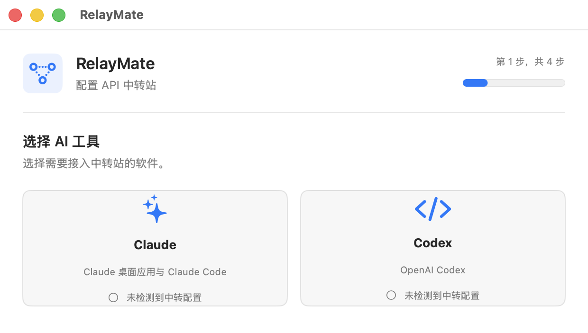

# RelayMate

[简体中文](README.md) · English

<p align="center">
  
</p>

RelayMate is a compact desktop utility for macOS and Windows for configuring an API relay in Claude Desktop, Claude Code, or OpenAI Codex. It validates the selected protocol before writing configuration and can restore the exact files that existed before the first application.

The app guides setup in four steps: choose Claude or Codex, select a saved relay or enter a new URL, enter the API key, then choose models. The model step automatically reads the relay's complete `/v1/models` catalog. For both clients, check every model that should appear in the model menu and choose one checked model as the default. RelayMate saves multiple named relays locally, including separate Claude and Codex model selections, so they can be tested and switched later. Manual model entry remains available.

Selecting a client scans that client's standard configuration file. RelayMate preserves detected relay details in its saved platform list before applying another relay. Existing Codex provider tables remain unchanged unless the user explicitly selects historical-session redirection. Restore is offered only after RelayMate has saved a valid baseline.

RelayMate does not read, import, or depend on CC Switch data.

RelayMate is open source under the MIT License. It does not include provider presets, relay credentials, analytics, or telemetry.

## Supported clients

- Claude Desktop and Claude Code through the Anthropic Messages protocol
- OpenAI Codex through the OpenAI Responses protocol

Codex relays must implement the Responses API. Chat Completions-only endpoints are rejected by the connectivity test, which says so explicitly instead of reporting a generic failure: when `/v1/responses` looks absent but `/v1/chat/completions` answers, the error names the missing protocol and asks for a relay that provides Responses. Current Codex releases have removed `wire_api = "chat"`, so RelayMate never writes it. A transient gateway failure is retried once, and every remaining failure keeps its HTTP status code in the message even when the relay returns an empty body.

## Build

### macOS

Requirements: macOS 13 or later and Xcode 15 or later.

```bash
swift test --disable-sandbox
scripts/package-dmg.sh
```

The universal Apple Silicon and Intel application, DMG, and SHA-256 checksum are written to `dist/`.

### Windows x86

Requirements: Windows 10 version 1809 or later and the .NET 10 SDK. The WinUI XAML compiler requires a Windows build host.

```powershell
dotnet run --project windows/RelayMate.Core.Tests/RelayMate.Core.Tests.csproj --configuration Release
scripts/package-windows.ps1 -Architecture x86
```

A distributable single executable (`dist/RelayMate-Windows-x86.exe`), its SHA-256 checksum, a publish inspection directory, and a ZIP are written to `dist/`. The single executable extracts its WinUI runtime payload to the current user's temporary directory on first launch, so the first launch can take longer. Pass `-Architecture x64` for a 64-bit build. Startup failures are shown in a dialog and logged to `%LOCALAPPDATA%\RelayMate\logs\startup.log`. Keep the single-file executable's build-time filename unchanged; renaming a WinUI 3 single-file executable can break XAML resource resolution. See [docs/windows-port.md](docs/windows-port.md) for paths, recovery behavior, and release verification.

## Configuration and recovery

Claude Code configuration is merged into `~/.claude/settings.json`. Claude Desktop is switched to its third-party deployment mode and receives a RelayMate-owned gateway profile under `~/Library/Application Support/Claude-3p/`; fully quit Claude before reopening it. Codex writes the active model and owned relay provider directly into `~/.codex/config.toml`, plus a RelayMate-owned model catalog under the same directory; `CODEX_HOME` is respected when set.

For Claude Code, a URL ending in `/v1` is normalized before it is written because Claude Code appends `/v1/messages` itself. Model discovery still uses the entered relay URL's `/v1/models` endpoint.

Each Codex conversation remembers the provider *name* it was created with, and the address is looked up from `config.toml` at request time, so pointing Codex at a new relay only affects new conversations. The URL step lists other providers already present in `config.toml` together with how many stored sessions reference each one. They remain unchecked and unchanged by default. Explicitly checking one redirects those historical conversations; the original table is covered by the same exact restoration backup. Claude needs no equivalent because Claude Desktop and Claude Code read one process-wide configuration after restart.

On macOS, original files are stored privately under `~/Library/Application Support/RelaySetup/`. On Windows, they are stored under `%LOCALAPPDATA%\RelayMate\`. A restore proceeds immediately when managed files still match the last applied version. External changes require explicit confirmation before restoring the original bytes.

## Contributing and security

See [CONTRIBUTING.md](CONTRIBUTING.md) before opening a pull request. Please report security issues privately using the process in [SECURITY.md](SECURITY.md).
