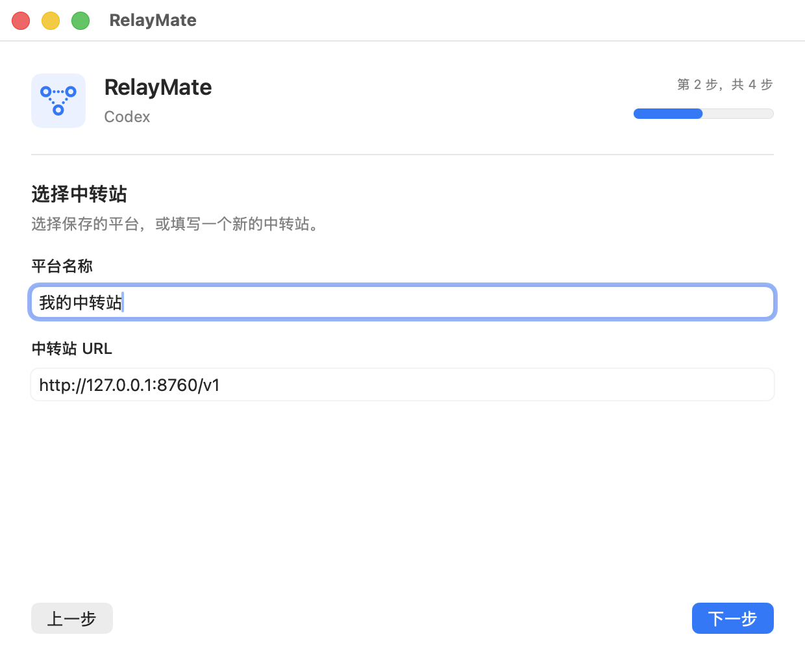
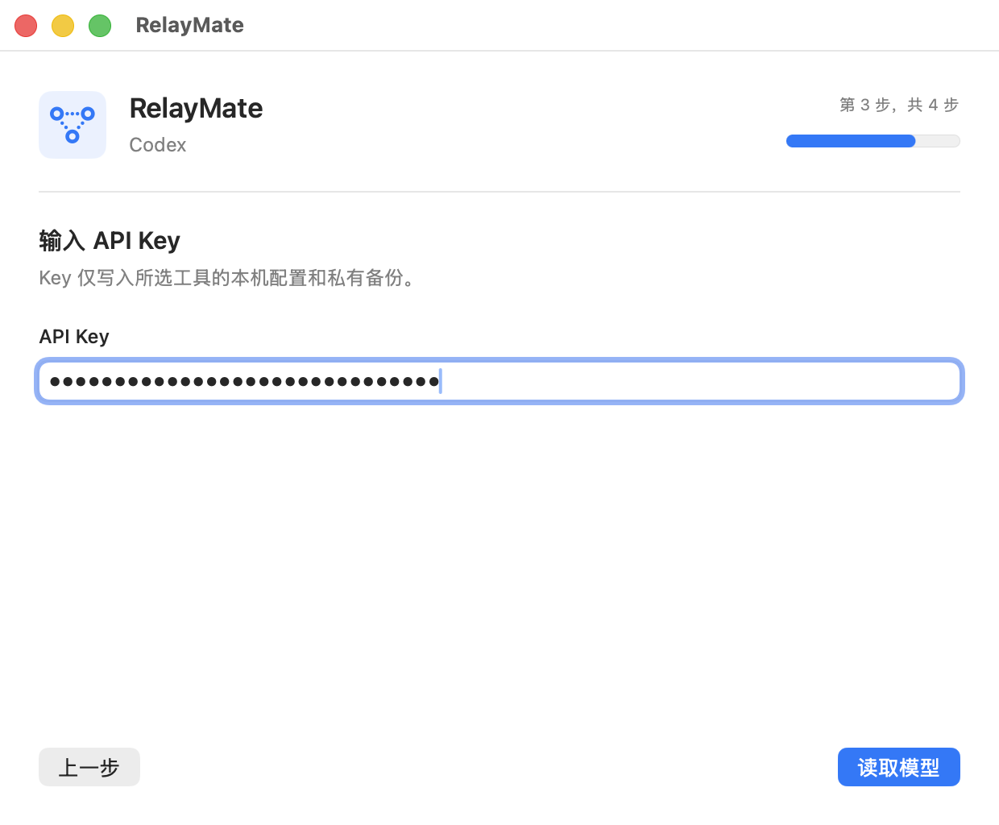
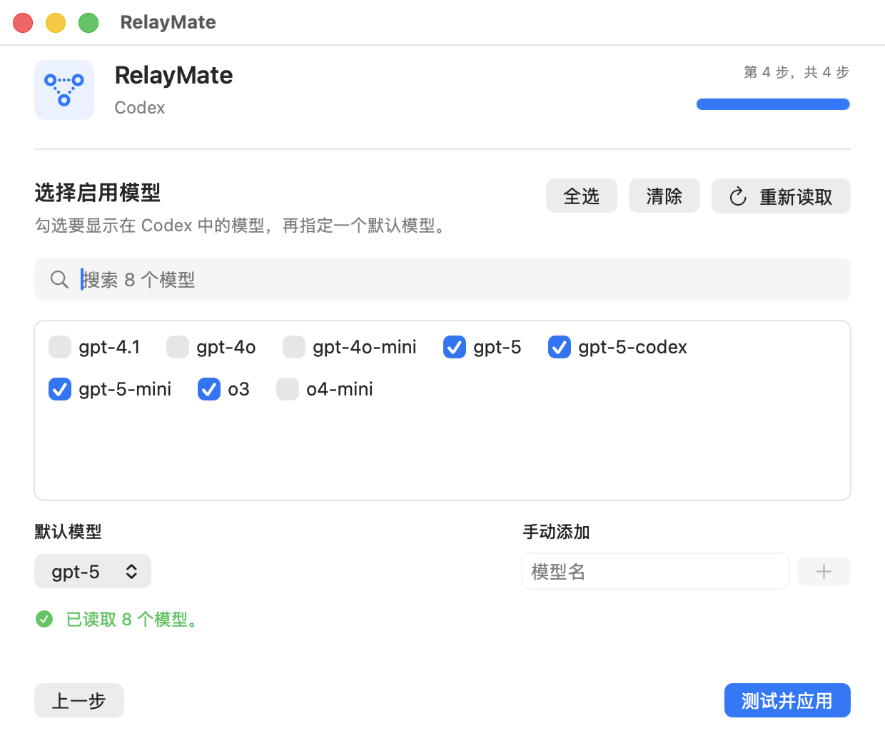
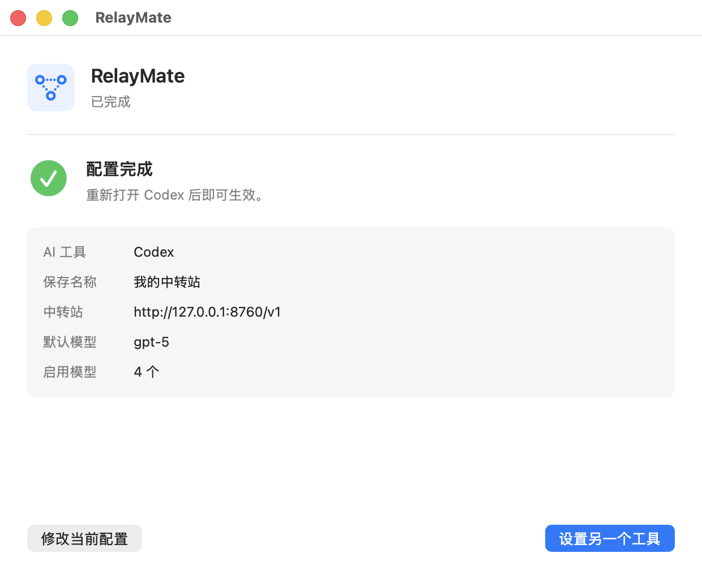

<p align="center">
  
</p>

<h1 align="center">RelayMate</h1>

<p align="center">不用修改配置文件，四步让 Claude 或 Codex 使用 API 中转站。</p>

<p align="center">简体中文 · <a href="README.en.md">English</a></p>

<p align="center">
  
</p>

RelayMate 是一个精简的 macOS 设置向导，适合已经拿到中转站 URL 和 API Key，但不想研究 JSON、TOML、环境变量或第三方部署模式的用户。它会读取中转站的模型列表，让你勾选需要的模型，测试连接成功后再修改 Claude 或 Codex 的配置。

它不会启动本地代理，不常驻后台，不接管网络，也不读取 CC Switch 或其他切换工具的数据。

## 先认识三个名词

已经清楚这三个概念的，可以直接跳到[下载与安装](#下载与安装)。

**中转站 URL（Base URL）** —— 中转站给你的那个网址，形如 `https://api.example.com/v1`。它是服务器地址，不是某个具体接口，你**不需要**自己在后面拼 `/messages` 或 `/chat/completions`，RelayMate 会按各个软件的规矩自动处理。照抄中转站给你的原文即可。

**API Key** —— 中转站发给你的密钥，通常以 `sk-` 开头，等同于你的钱包密码。不要发到群里、截图或提交进 Git 仓库。RelayMate 只把它写到本机配置和本机私有备份，不上传任何地方。

**模型（Model）** —— 例如 `claude-sonnet-4-5`、`gpt-5`。不同中转站上架的模型不一样，名字也可能有细微差别。这正是 RelayMate 最省事的地方：填完 Key 之后它会自动读取中转站的模型目录列给你勾选，不用靠猜。

## 能做什么

- 同时支持 Claude 桌面应用、Claude Code 和 OpenAI Codex。
- 自动读取中转站的 `/v1/models` 模型列表。
- 勾选多个模型，并指定其中一个作为默认模型。
- 保存多个中转平台，下次选择后自动填入 URL、Key 和上次使用的模型。
- 应用前发送一个最小测试请求，测试失败不会修改配置。
- 自动备份第一次修改前的原文件，随时可以一键还原。
- 每次打开都会扫描目标软件的实际配置，不依赖 RelayMate 自己的状态判断。
- 保留配置文件中与中转站无关的其他设置。

## 支持范围

| AI 工具 | 中转站需要支持的接口 | RelayMate 会配置的内容 |
|---|---|---|
| Claude 桌面应用 | Anthropic Messages | 第三方部署模式、Gateway 配置和模型列表 |
| Claude Code | Anthropic Messages | URL、API Key、默认模型 |
| OpenAI Codex | OpenAI Responses | URL、API Key、启用模型和默认模型 |

Codex 当前要求中转站支持 OpenAI Responses 接口。只能调用 `/v1/chat/completions` 的中转站即使能读取模型，也不能用于新版 Codex，RelayMate 会在测试时明确提示。

## 下载与安装

系统要求：macOS 13 或更高版本。安装包同时支持 Apple Silicon 和 Intel Mac。

1. 在项目右侧的 **Releases** 中下载 `RelayMate.dmg`。
2. 双击打开下载的 DMG。
3. 把左侧的 **RelayMate** 拖到右侧的 **Applications** 文件夹。
4. 在“应用程序”中打开 RelayMate。

当前公开安装包没有 Apple Developer 签名和公证。macOS 第一次拦截时，在“应用程序”里按住 Control 点击 RelayMate，选择“打开”，然后再次确认“打开”。后续可以正常双击启动。

如果弹窗里没有出现“打开”按钮，在“终端”中执行下面这一行，去掉隔离标记后再正常双击：

```bash
xattr -d com.apple.quarantine /Applications/RelayMate.app
```

不放心预编译包的，可以[自己从源码构建](#从源码构建)，两条命令即可。

## 第一次设置

打开 RelayMate 后只需要完成四步，窗口右上角一直显示当前进度。

下面的截图为首次使用的完整流程，其中的地址 `http://127.0.0.1:8760/v1` 只是演示用的本机地址，实际使用时填写中转站给你的地址。

### 第 1 步 · 选择 AI 工具

选择 Claude 或 Codex，界面就是本页开头那张图。Claude 选项会同时配置 Claude 桌面应用和 Claude Code。每张卡片下面标着该软件当前的状态，含义见[看懂界面上的状态](#看懂界面上的状态)。

### 第 2 步 · 选择中转站



第一次使用时填写一个容易辨认的平台名称和中转站 URL。以后可以直接从“已保存的平台”下拉框选已存过的平台，URL 和 Key 会自动填好。

上图是首次使用的样子。配置 Codex 时，如果 `config.toml` 里已经有别的 provider，这一步还会多出一组“让旧对话也用这个中转站”的勾选框，并显示每个 provider 下有多少个历史对话（例如 `custom`，119 个）。原因是 Codex 的每个历史对话都记着自己创建时用的 provider **名字**，请求时再按名字去 `config.toml` 里查地址；因此只添加一个新 provider 的话，老对话仍然会往老地址发请求。勾上对应项，RelayMate 会把那些配置段一并改成新地址，老对话就跟着换过来了；这些改动同样在备份范围内，还原时会一起恢复。

Claude 没有这个问题——Claude 桌面应用和 Claude Code 都是整个进程读同一份配置，重启后所有对话自动走新地址。

### 第 3 步 · 输入 API Key



填写中转站提供的 Key，然后点击“读取模型”。输入框是密码框，不会明文显示。

### 第 4 步 · 选择模型



上半部分是**从中转站实际读回来的模型列表**，勾选你希望出现在目标软件模型菜单里的那些，模型多时可以用搜索框过滤，也有“全选 / 清除”。下方的“默认模型”从已勾选的模型里挑一个。

如果中转站不开放模型目录、这里读不到列表，用右下角的“手动添加”直接输入模型名，加进去会自动设为默认模型。

最后点击“测试并应用”。顺序是固定的：先向中转站发一个真实的最小请求做验证，验证通过才备份原文件并写入新配置；验证不通过则**任何文件都不会被修改**，界面上直接显示失败原因。

### 完成



看到“配置完成”后，请完全退出目标 AI 软件再重新打开。只关闭窗口可能不会重新加载配置：

- Claude：完全退出 Claude 桌面应用和 Claude Code，再重新打开。
- Codex：完全退出 Codex，再重新打开。

## 看懂界面上的状态

每次打开 RelayMate，它都会重新扫描 Claude 和 Codex 的实际配置文件，并在卡片上标出当前状态。这决定了你能做哪些操作：

| 状态 | 含义 | 可以做什么 |
|---|---|---|
| 未检测到中转配置 | 当前使用官方服务，或者从未配置过 | 直接开始设置 |
| 已配置（非本工具管理） | 之前手动改过，或者用其他工具配过 | 可以沿用现有信息继续设置；**不能还原**，因为 RelayMate 没有保存过你的原文件 |
| 由 RelayMate 管理 | 这份配置由 RelayMate 写入，且与上次应用的内容一致 | 可以重新设置，也可以直接还原 |
| 配置后来被修改 | RelayMate 写入之后，文件又被其他程序改过 | 可以重新设置；还原时会先要求确认 |
| 配置无法读取 | 目标软件的配置文件格式损坏或不可读 | 先手动修好格式再回来设置，RelayMate 不会在损坏的文件上写入 |

## 保存和切换多个中转平台

每次成功应用后，RelayMate 会自动保存当前平台。保存内容包括平台名称、URL、API Key，以及 Claude 和 Codex 各自上次启用的模型。

如果 RelayMate 在 Claude 或 Codex 的标准配置中发现已有中转站，会先把它保留到平台列表。Codex 的其他 provider 配置也会保留，除非你明确勾选“让旧对话也用这个中转站”，否则 RelayMate 不会改写它们。

切换时重新打开 RelayMate，选择 AI 工具，在“已保存的平台”中选择目标平台，然后继续读取模型、测试并应用。RelayMate 仍会在切换前验证连接，不会把已经失效的平台直接写入配置。

点击垃圾桶按钮只会删除 RelayMate 保存的平台资料，不会修改 Claude 或 Codex 当前正在使用的配置，也不会删除原配置备份。

## 还原原配置

RelayMate 第一次修改某个 AI 工具时，会保存原文件的精确副本。需要恢复时：

1. 重新打开 RelayMate。
2. 选择 Claude 或 Codex。
3. 点击“还原原配置”。
4. 完全退出目标软件并重新打开。

如果配置在 RelayMate 应用之后又被其他程序修改，RelayMate 会先提醒你，避免静默覆盖后来的变化。还原成功后，原来不存在的文件会被删除，原来存在的文件会恢复为修改前的内容。

## 它会改动哪些文件

为了完全透明，这里列全 RelayMate 写入的位置：

| 目标 | 文件 | 写入方式 |
|---|---|---|
| Claude Code | `~/.claude/settings.json` | **合并**写入，保留其中与中转站无关的原有设置 |
| Claude 桌面应用 | `~/Library/Application Support/Claude-3p/` 下的配置 | 切换到第三方部署模式，写入一份 RelayMate 自有的 Gateway profile |
| Codex | `~/.codex/config.toml` | 写入默认模型和 RelayMate 自有的 provider 段（设置了 `CODEX_HOME` 时跟随该目录） |
| Codex | `~/.codex/relaymate-model-catalog.json` | RelayMate 自有的模型目录，只包含你勾选的模型，由 `config.toml` 引用 |
| RelayMate 自己 | `~/Library/Application Support/RelaySetup/` | 原文件备份和已保存的平台资料 |

`~/Library/Application Support/RelaySetup/` 是“还原原配置”的唯一依据，**不要手动删除这个目录**，删掉之后就无法还原了。

除上表之外，RelayMate 不会修改你项目里的任何文件，不安装后台常驻服务，也不设置开机自启。

## 数据和隐私

RelayMate 没有账号、云同步、统计、遥测或自动更新服务。中转站信息只保存在当前 Mac：

- Claude 和 Codex 正常运行所需的配置文件。
- `~/Library/Application Support/RelaySetup/saved-relays.json`，用于保存多个平台。
- 同目录中的还原备份记录。

这些 RelayMate 私有文件使用仅当前用户可读写的权限。由于目标软件本身需要读取 API Key，Key 必须写入其本机配置；请不要把这些配置文件、备份或截图发到公开 Issue。

## 常见问题

### 报错对照表

| 界面上的提示 | 实际原因 | 处理方式 |
|---|---|---|
| 请输入完整的中转站 URL。 | URL 格式不正确 | 检查是否漏了 `https://`，是否带了多余空格 |
| 远程中转站必须使用 HTTPS。 | 填的是 `http://` 的远程地址 | 改用 `https://`；只有 `localhost`、`127.0.0.1`、`::1` 允许 HTTP |
| API Key 未通过验证，… | Key 填错、已过期，或余额用尽 | 到中转站后台核对 Key 与余额 |
| 该中转站只提供 OpenAI Chat Completions 接口，没有 OpenAI Responses 接口。 | 这条线路无法用于新版 Codex | 更换支持 Responses 接口的中转线路 |
| 模型列表为空，可直接手动输入模型名。 | 中转站没有实现模型目录接口 | 用“手动添加”直接输入模型名，不影响使用 |
| 无法连接中转站：… | 网络不通、地址写错，或中转站故障 | 提示中会保留 HTTP 状态码，据此排查 |
| 现有配置无法安全修改：… | 目标软件的配置文件格式损坏 | 先修好那份 JSON / TOML 再回来设置 |
| 没有找到可还原的原始配置。 | 当前配置不是 RelayMate 写入的 | 只能手动改回，或重新用 RelayMate 设置一次 |
| 配置文件在应用后被其他程序修改。 | 还原前的安全确认 | 确认要覆盖后来的改动，就选“仍然还原” |

### 能读取模型，但“OpenAI Responses 请求失败”

模型列表和实际对话是两个不同接口。出现这个提示说明 `/v1/models` 可用，但所选模型通过 `/v1/responses` 调用失败。错误后面会显示中转站返回的信息和 HTTP 状态码。常见原因是该线路只支持 Chat Completions、模型没有开通 Responses，或中转站暂时故障。

### 配置完成后仍然走官方服务

先完全退出 Claude 或 Codex 再打开。Claude 桌面应用需要重新启动到 Gateway 模式，单纯关闭窗口通常不够。还可以重新打开 RelayMate，选择对应工具，确认它扫描到“由 RelayMate 管理”。

### 模型列表为空或读取失败

检查 URL 是否完整、Key 是否正确。中转站没有实现模型列表接口时，可以在模型步骤使用“手动添加”。手动添加的模型仍会经过实际请求测试。

### HTTP 地址为什么不能用

远程 API Key 通过普通 HTTP 传输会被窃取，所以 RelayMate 只允许远程 HTTPS。用于本机调试的 `localhost`、`127.0.0.1` 和 `::1` 可以使用 HTTP。

### Claude 桌面应用的模型菜单里少了几个我勾过的模型

Claude 桌面应用对模型 ID 的格式有要求，RelayMate 会自动过滤掉它无法识别的 ID，避免写进去导致模型菜单异常。Claude Code 不受这个过滤影响。

### 1M 长上下文要怎么开

不需要你操作。当中转站在模型信息里明确标注了 `supports1m` 或 `supports_1m` 时，RelayMate 会自动为 Claude 桌面应用启用该能力；没有标注的模型保持原样不动，所以界面上不会多出一个需要你判断的开关。

### 这个工具收费吗，会不会抽成

不收费。项目使用 MIT License 开源，**不内置任何中转站、不推荐任何服务商、没有分销或返利**。你的中转站从哪里来、花了多少钱，与本项目无关。

### Windows 可以用吗

当前版本只支持 macOS。Windows 移植范围、配置路径和验收要求见 [Windows 移植说明](docs/windows-port.md)，欢迎贡献 Windows 客户端。

## 从源码构建

开发要求：macOS 13 或更高版本，Xcode 15 或更高版本。

```bash
swift test --disable-sandbox
scripts/package-dmg.sh
```

生成的应用和安装包位于 `dist/`：

- `dist/RelayMate.app`
- `dist/RelayMate.dmg`
- `dist/RelayMate.dmg.sha256`

项目使用 MIT License。提交代码前请阅读 [贡献指南](CONTRIBUTING.md)；安全问题请按 [安全策略](SECURITY.md) 私下报告。
